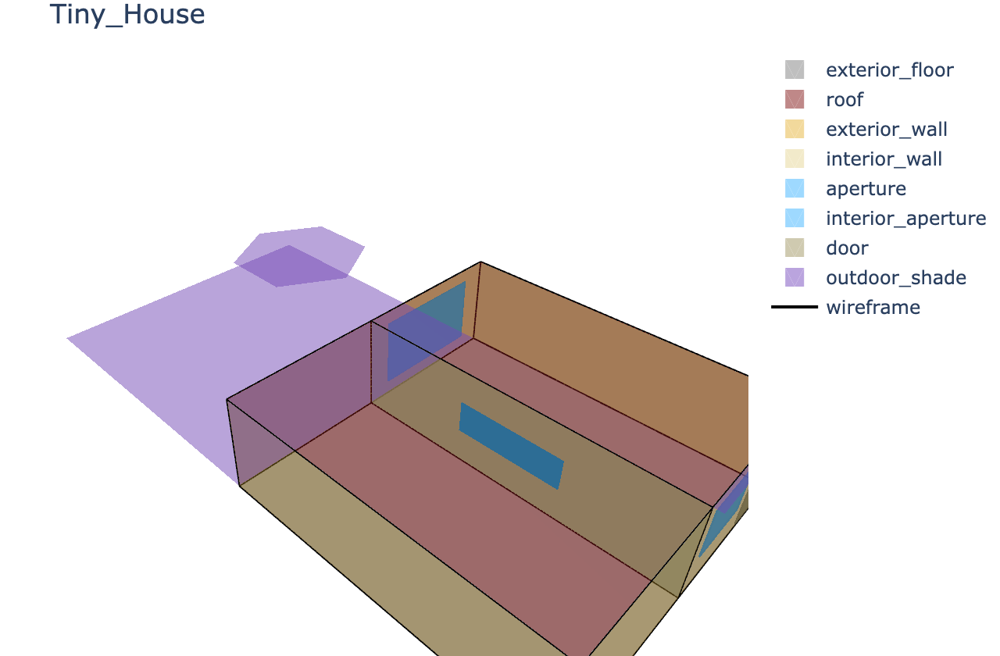
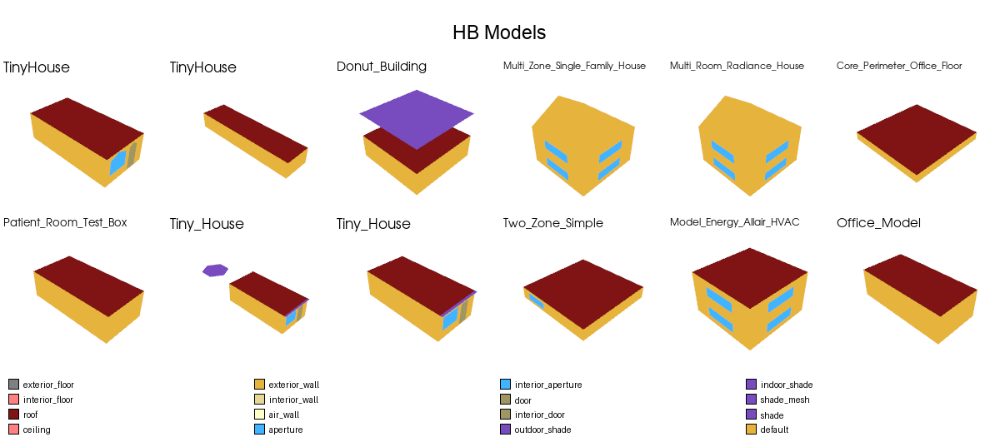

# Jupyter Honeybee Plot

Visualization utilities for rendering [Honeybee](https://github.com/ladybug-tools/honeybee-core) models directly inside Jupyter notebooks.

This package provides two functions - `plot_honeybee_model` and `plot_honeybee_models` - designed for visualization of [Honeybee](https://github.com/ladybug-tools/honeybee-core) building energy models.  
It also includes an example workflow with sample models fetched from Github [Honeybee-schema](https://github.com/ladybug-tools/honeybee-schema/tree/master/samples/model).

---

### Plot a single Honeybee model interactively in Jupyter

The `plot_honeybee_model()` function renders one Honeybee `Model` as an interactive 3D visualization inside a Jupyter notebook. It is designed for fast, lightweight inspection of model geometry, supporting selective surface visibility, transparency, wireframe overlays, and adjustable camera scaling. The visualization is built using **Plotly**, enabling rotation, zooming, and exporting to HTML.

**Inputs**

* `model`: a `honeybee.model.Model` instance loaded from file or memory
* `title`: controls how the figure is titled

  * Omitted (default): inferred from `model.display_name` or `model.identifier`
  * String: uses that text as title
  * `None`: hides the title entirely
* `extrude_eps`: a small extrusion offset (default `0.02 m`) applied to thin surfaces like apertures or doors to avoid z-fighting artifacts
* `figsize`: figure size in pixels, e.g. `(640, 420)`
* `show`: if `True`, displays the plot inline in Jupyter; if `False`, returns a Plotly `Figure` for export
* `show_wireframe`: overlays thin wireframes around surfaces for geometric clarity
* `surface_opacity`: controls transparency of filled surfaces (`0–1`)
* `show_legend`: displays a color legend for surface categories (walls, roofs, floors, etc.)
* `include_types`: restricts visualization to selected surface categories (e.g., `["Wall", "Roof", "Floor"]`)
* `room_ids`: optional list of specific room identifiers to plot
* `background_color`: plot background color (`"white"` by default)
* `aspectmode`: sets the 3D aspect ratio mode; `"data"` preserves physical proportions


**Outputs**

* A `plotly.graph_objects.Figure` object visualizing the Honeybee model.

  * Shown interactively in Jupyter if `show=True` (default).
  * Can be saved via `fig.write_html("model.html")`.

**Example usage**

```python
from honeybee.model import Model
from jupyter_honeybee_plot import plot_honeybee_model

model = Model.from_hbjson("tiny_house.hbjson")
plot_honeybee_model(model, show_wireframe=True, show_legend=True)
```

## Preview

[]

---

### Plot multiple Honeybee models in a grid layout

The `plot_honeybee_models()` function renders multiple Honeybee models at once and composes them into a single grid image. Each model is drawn in an off-screen **PyVista** renderer, then assembled into one composite canvas using **Pillow**. This layout makes it easy to compare geometries, test cases, or model variations side by side.

**Inputs**

* `models`: iterable of Honeybee `Model` objects to visualize
* `model_titles`: optional sequence of per-tile titles

  * Omitted (default): inferred from `display_name` or `identifier`
  * `None`: disables titles
* `main_title`: optional global title above all subplots
* `grid`: `(rows, cols)` layout; inferred automatically if `None`
* `extrude_eps`: extrusion offset for thin surfaces (default `0.02 m`)
* `figsize`: per-tile render size in pixels (default `(640, 420)`)
* `total_width`: width of the combined image (default `1200 px`)
* `base_model_height`: height allocated to each model tile (default `600 px`)
* `plot_main_legend`: whether to show a single global legend at the bottom
* `show`: if `True`, displays the final image inline; if `False`, returns a `PIL.Image` for saving
* `view`: predefined camera orientation or `(elev, azim)` tuple (`"iso"`, `"top"`, `"front"`, etc.)
* `camera_zoom`: zoom multiplier after fitting (default `1.25`)
* `background_color`: sets PyVista background color for each tile
* `legend_labels`: optional custom text for legend entries
* `**plot_kwargs`: forwarded to `pyvista.Plotter.add_mesh` (e.g., `surface_opacity=0.6`, `show_wireframe=True`)

**Outputs**

* When `show=True`: displays the composite grid image inline in Jupyter (default).
* When `show=False`: returns a `PIL.Image` object, which can be saved or further processed.

**Example usage**

```python
from honeybee.model import Model
from jupyter_honeybee_plot import plot_honeybee_models

models = [Model.from_hbjson(p) for p in hbjson_paths]
img = plot_honeybee_models(models, main_title="HB models", show=False)
img.save("hbmodels.png")
```

## Preview



## Installation

```bash
pip install -r requirements.txt
```

## Acknowledgments

This project builds upon the open-source [Ladybug Tools](https://github.com/ladybug-tools)
ecosystem, particularly:
- [Honeybee Core](https://github.com/ladybug-tools/honeybee-core)
- [Honeybee Schema](https://github.com/ladybug-tools/honeybee-schema)

All sample models are dynamically fetched from the official Honeybee-schema repository and are not redistributed here.

## License

This project is released under the **MIT License**.
- Honeybee and Honeybee-schema are licensed under the **GNU General Public License v3.0 (GPLv3)**.
- This repository **does not redistribute or modify** those libraries or their sample data.
- Instead, it interacts with their **public APIs** and fetches sample models directly from the official Honeybee-schema GitHub repository.

By using this package, you agree to comply with the licenses of all dependencies.
